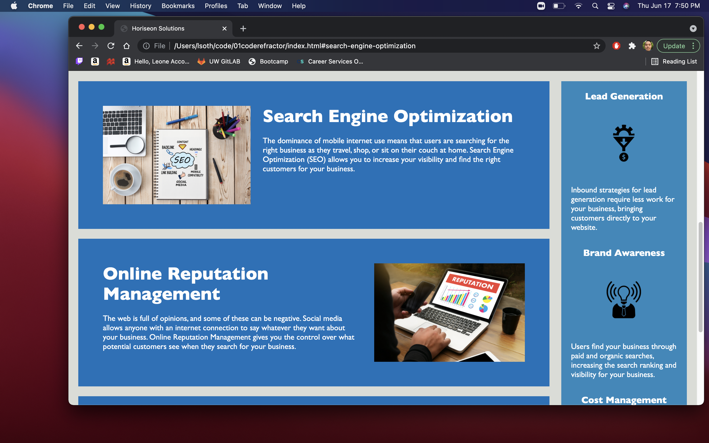

# Code Refractor

## Description

Hello! For this application, I was provided some code to refract. 
The motivations for the refraction for this project was to increase 
accessibility by adding alt attributes to the primary images on the page.
Furthermore to fix some broken links, and update the application to include
updated semantics. 

By performing these actions, it reiterated the importance of making elements of 
an application accessible, not only when people cant see an image but also to provide
information about an image to convey the ideas of the client, when a page cannot properly 
load. 

## Installation

To open the project just visit this url: https://lsoth.github.io/01coderefractor/

## Usage

Here are some examples of what the website looks like, the links in the header of the page
all work to take you to the different sections of the page. 

## Credits

In order to help accomplish my goals, I referenced a few different websites and information from class.
The websites include:

https://www.w3schools.com/html/html5_semantic_elements.asp

https://supercooldesign.co.uk/blog/how-to-write-good-alt-text

https://moz.com/learn/seo/alt-text

## Licence

no licence